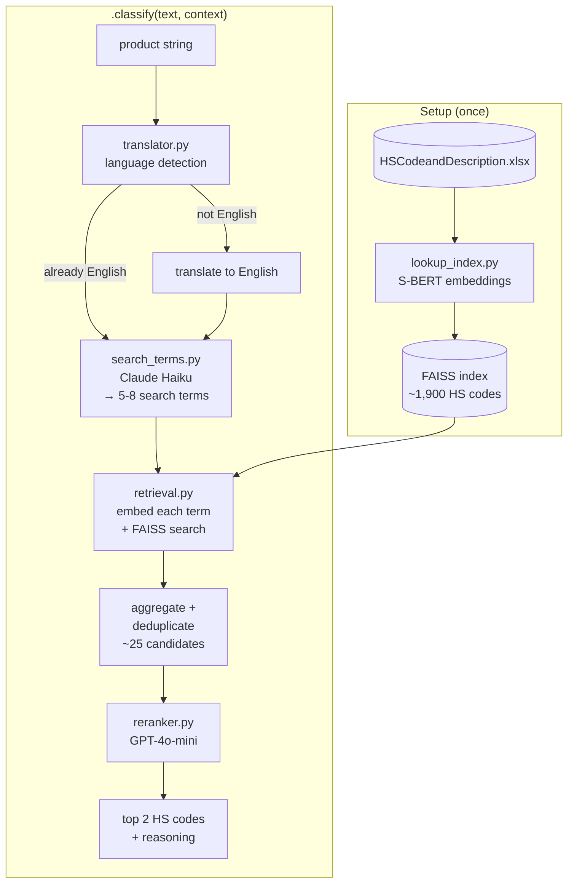

# HS Code Classifier

Takes a product description string and returns the best-matching Harmonized System (HS) trade codes.

```python
from pipeline import Classifier

clf = Classifier()  # loads models once
result = clf.classify("solar panel inverter", context="...article text...")
# {
#   "code_first":      "8504",
#   "desc_first":      "Electrical transformers, static converters and inductors",
#   "code_second":     "8541",
#   "desc_second":     "Semiconductor devices",
#   "reason":          "...",
#   "detected_lang":   "en",
#   "claude_terms":    ["inverter", "power converter", ...],
#   "retrieved_codes": ["8504: ...", "8541: ...", ...]
# }
```

## How it works



**Stage 0 — Language detection** (`modules/translator.py`)
Input text is detected for language. Translation is not implemented on `main` yet; non-English text is currently passed through unchanged.

**Stage 1 — Thesaurus / search term generation** (`modules/search_terms.py`)
Claude receives the product string and optional context and generates 5-8 search terms drawn from the HS vocabulary — generic product class names that will match well in the embedding space.

**Stage 2 — Retrieval** (`modules/retrieval.py`)
The original query and each generated term are independently embedded and searched against a FAISS index of HS code descriptions. Results are pooled and deduplicated, yielding ~25 candidate codes.

**Stage 3 — Reranking** (`modules/reranker.py`)
GPT-4o-mini receives the shortlist and selects the top 2 HS codes with a short justification.

The FAISS index is built once when `Classifier()` is initialised and reused across all `.classify()` calls.

## Project structure

```
pipeline.py               # Classifier class — the public interface

modules/
├── config.py             # Settings dataclass: API keys, model names, paths, parameters
├── lookup_index.py       # Load HS descriptions, generate/load S-BERT embeddings, build FAISS index
├── translator.py         # Language detection and translation to English (langdetect)
├── search_terms.py       # Prompt + tool schema for search term generation
├── retrieval.py          # Embed terms, search FAISS, aggregate and deduplicate
└── reranker.py           # Prompt + tool schema for reranking

scripts/
└── 1_generate_embeddings.py  # Encode HS descriptions → .npy (one-time)

data/
├── raw/                  # HSCodeandDescription.xlsx
└── intermediate/         # hs12_4_embeddings.npy
```

## Branches

- `main` keeps the MVP classifier only: load HS data, retrieve candidates, rerank, and return top HS codes.
- `evals` is for split construction, labeling, metrics, notebooks, and benchmark workflow.
- `llm-upgrade` is for provider abstraction work, including making `search_terms.py` and `reranker.py` call through a shared LLM interface.

## Setup

```bash
uv sync
cp .env.example .env  # fill in OPENAI_API_KEY and ANTHROPIC_API_KEY
```

### Required data files

```
data/raw/HSCodeandDescription.xlsx        # HS code reference table (sheet "HS12")
data/intermediate/hs12_4_embeddings.npy   # pre-computed S-BERT embeddings
```

Generate the embeddings once after placing the Excel file:

```bash
uv run python scripts/1_generate_embeddings.py
```

## Models

| Role | Model |
|---|---|
| Embeddings | `dell-research-harvard/lt-un-data-fine-fine-en` (S-BERT, trade concordance fine-tune) |
| Term generation | Claude 3.5 Haiku |
| Reranking | GPT-4o-mini |

On `main`, term generation and reranking still call Anthropic and OpenAI directly. Provider-agnostic routing is planned for the `llm-upgrade` branch rather than documented as completed here.

## Notes

This is a rewrite of an earlier monolithic script. Key differences:

- **FAISS built once** — the original rebuilt the index on every query (~48,000 times per full run)
- **No hardcoded secrets** — API keys now loaded from `.env`
- **Flat structure** — original was a single 440-line script; now split into focused modules
