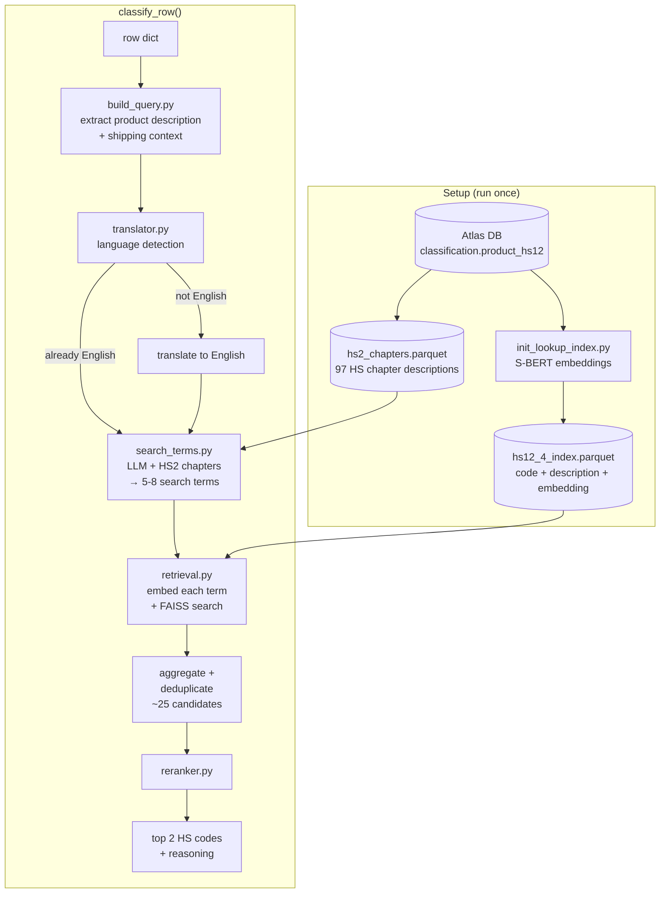

# hs-classifier

Takes a product description string and returns the best-matching Harmonized System (HS) trade codes.

## Quick start

```bash
uv sync
cp .env.example .env  # fill in API keys, Atlas DB credentials, and model choices
uv run run_init.py    # one-time: build FAISS index from Atlas DB
```

```python
from hs_classifier import init_classifier, classify_row

classifier = init_classifier()

row = {"product_description": "frozen shrimp", "container_description": "20ft reefer"}
result = classify_row(row, classifier)

result["code_first"]   # e.g. "0306"
result["desc_first"]   # "Crustaceans; ..."
result["code_second"]  # e.g. "1605"
result["reason"]       # LLM justification
```

### CLI

```bash
uv run run_pipeline.py                          # default: row 1 from ecuador_sample
uv run run_pipeline.py --row_index 5            # different row
uv run run_pipeline.py --csv_path data/raw/other.csv --row_index 0
```

## Configuration

All configuration lives in `.env` (see `.env.example`):

**API keys**
- `GOOGLE_API_KEY` — for Gemini models
- `COHERE_API_KEY` — optional, for Cohere models
- `HF_TOKEN` — for S-BERT model downloads
- Atlas DB credentials (`ATLAS_HOST`, `ATLAS_PORT`, `ATLAS_USER`, `ATLAS_PASSWORD`, `ATLAS_DB`)

**Models**

| `.env` variable | Role | Default |
|---|---|---|
| `EMBEDDING_MODEL` | S-BERT embeddings for FAISS index | `dell-research-harvard/lt-un-data-fine-fine-en` |
| `SEARCH_TERM_MODEL` | LLM for search term generation | `google/gemini-2.5-flash-lite` |
| `RERANKER_MODEL` | LLM for reranking candidates | `google/gemini-2.5-flash-lite` |

LLM models use `instructor.from_provider()`, so any supported provider string works (e.g. `anthropic/claude-sonnet-4-20250514`, `cohere/command-r-plus`).

## How it works



**Stage 0 — Language detection** (`hs_classifier/translator.py`)
Input text is detected for language using Lingua. Non-English text is translated via the `translators` package (Google backend).

**Stage 1 — Search term generation** (`hs_classifier/search_terms.py`)
The LLM receives the product string, shipping context, and the 97 HS2 chapter descriptions as guidance. It generates 5-8 search terms using HS vocabulary that will match well in the embedding space.

**Stage 2 — Retrieval** (`hs_classifier/retrieval.py`)
The original query and each generated term are independently embedded and searched against a FAISS index of HS code descriptions. Results are pooled and deduplicated, yielding ~25 candidate codes.

**Stage 3 — Reranking** (`hs_classifier/reranker.py`)
The LLM receives the shortlist and selects the top 2 HS codes with a short justification.

## Project structure

```
run_init.py               # One-time setup: build lookup index from Atlas DB
run_pipeline.py           # CLI wrapper for quick testing

hs_classifier/
├── __init__.py           # init_classifier() and classify_row()
├── init_lookup_index.py  # DB connection, S-BERT encoding, save index parquet
├── build_query.py        # Build one classifier query from one raw row
├── translator.py         # Lingua language detection + Google translation backend
├── search_terms.py       # LLM search term generation (Instructor + Pydantic)
├── retrieval.py          # Load index parquet, FAISS search, aggregate and deduplicate
└── reranker.py           # LLM reranking of candidates (Instructor + Pydantic)

data/
├── raw/                  # Sample CSV data (e.g. ecuador_sample.csv)
└── intermediate/         # hs12_4_index.parquet + hs2_chapters.parquet
```

## Future improvements

- **DeepL for translation (optional):** The current translator uses the `translators` package with the Google backend. A potential upgrade is to use the DeepL API directly (free plan available) for better translation quality, especially on trade/product descriptions.
- **Vector DB (optional):** FAISS works well at the current scale (~1,200 HS4 codes). A managed vector DB like Qdrant or LanceDB would only be worth it if we need persistence, filtering, or incremental updates at much larger scale.
