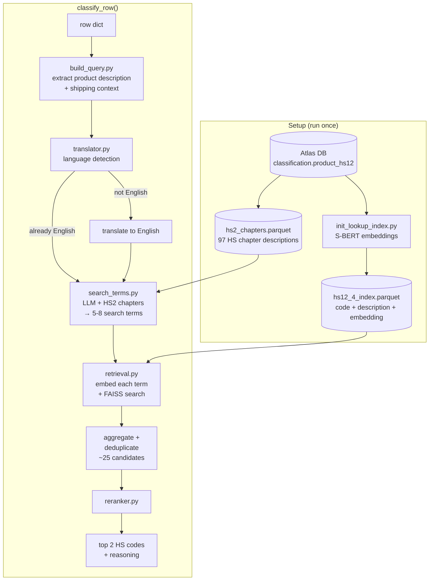

# hs-classifier

Takes a product description string and returns the best-matching Harmonized System (HS) trade codes.

## Installation

Requires Python 3.12+. Install into a virtual environment:

```bash
# uv (recommended)
uv venv && source .venv/bin/activate
uv add git+https://github.com/karandaryanani/panjiva-hscode.git

# or pip
python -m venv .venv && source .venv/bin/activate
pip install git+https://github.com/karandaryanani/panjiva-hscode.git
```

This installs `hs-classifier` and all its dependencies (faiss-cpu, instructor, polars, sentence-transformers, etc.).

## Quick start

```bash
cp .env.example .env  # fill in API keys, Atlas DB credentials, and model choices
```

### As a package

```python
from hs_classifier import init_index, init_classifier, classify_row

# One-time: build FAISS index from Atlas DB
init_index()                  # skips if already built
init_index(force=True)        # rebuild from scratch

# Load classifier (heavy resources: FAISS index, S-BERT model)
classifier = init_classifier()

# Classify a row
row = {"product_description": "frozen shrimp", "container_description": "20ft reefer"}
result = classify_row(row, classifier)

result.code_first    # e.g. "0306"
result.desc_first    # "Crustaceans; ..."
result.code_second   # e.g. "1605"
result.reason        # LLM justification
```

### CLI

```bash
uv run run_pipeline.py                          # default: row 1 from ecuador_sample
uv run run_pipeline.py --row_index 5            # different row
uv run run_pipeline.py --csv_path data/raw/other.csv --row_index 0
```

## Configuration

All configuration lives in `.env` (see `.env.example` for annotated defaults).

### Database

| Variable | Description |
|---|---|
| `ATLAS_HOST` | PostgreSQL host for HS code data |
| `ATLAS_PORT` | PostgreSQL port (default: 5432) |
| `ATLAS_USER` | Database username |
| `ATLAS_PASSWORD` | Database password |
| `ATLAS_DB` | Database name |

### LLM providers

Only the API key for your chosen provider is required. Install the corresponding package if not already present.

| Provider | API key variable | Example model string | Package |
|---|---|---|---|
| Google Gemini | `GOOGLE_API_KEY` | `google/gemini-2.5-flash-lite` | `google-genai` (included) |
| Anthropic | `ANTHROPIC_API_KEY` | `anthropic/claude-sonnet-4-20250514` | `anthropic` (included) |
| Cohere | `COHERE_API_KEY` | `cohere/command-r-plus` | `pip install cohere` |

LLM models use `instructor.from_provider()` — see [Instructor docs](https://python.useinstructor.com/) for the full list of supported providers.

### Models

| Variable | Role | Default |
|---|---|---|
| `EMBEDDING_MODEL` | S-BERT model for encoding HS descriptions and search queries into vectors | `dell-research-harvard/lt-un-data-fine-fine-en` |
| `SEARCH_TERM_MODEL` | LLM that generates 5-8 HS-vocabulary search terms from the product description | `google/gemini-2.5-flash-lite` |
| `RERANKER_MODEL` | LLM that picks the top 2 HS codes from the retrieval shortlist | `google/gemini-2.5-flash-lite` |

### Other

| Variable | Description |
|---|---|
| `HF_TOKEN` | Hugging Face token for downloading the S-BERT model |

### Retrieval parameters

| Variable | Default | Description |
|---|---|---|
| `TOP_K_TOTAL` | 25 | Total FAISS candidates retrieved across all searches. Higher = more candidates for the reranker (better recall, costlier reranking). |
| `TOP_K_BERT` | 10 | How many of those go to the original query. The rest are split evenly across the LLM-generated search terms. Higher = more weight on the raw query vs generated terms. |

## How it works



**Stage 0 — Language detection** (`hs_classifier/translator.py`)
Input text is detected for language using Lingua. Non-English text is translated via the `translators` package (Google backend). If already English, translation is skipped automatically.

**Stage 1 — Search term generation** (`hs_classifier/search_terms.py`)
The LLM receives the product string, shipping context (if available), and the 97 HS2 chapter descriptions as guidance. It generates 5-8 search terms using HS vocabulary that will match well in the embedding space.

**Stage 2 — Retrieval** (`hs_classifier/retrieval.py`)
The original query and each generated term are independently embedded with S-BERT and searched against a FAISS index of HS code descriptions. Results are pooled and deduplicated, yielding ~25 candidate codes.

**Stage 3 — Reranking** (`hs_classifier/reranker.py`)
The LLM receives the candidate shortlist and selects the top 2 HS codes with a short justification. Context is included in the prompt when available.

## Project structure

```
run_init.py               # One-time setup: build lookup index from Atlas DB
run_pipeline.py           # CLI wrapper for quick testing

hs_classifier/
├── __init__.py           # init_index(), init_classifier(), and classify_row()
├── init_lookup_index.py  # DB connection, S-BERT encoding, save index parquet
├── build_query.py        # Build one classifier query from one raw row
├── translator.py         # Lingua language detection + Google translation backend
├── search_terms.py       # LLM search term generation (Instructor + Pydantic)
├── retrieval.py          # Load index parquet, FAISS search, aggregate and deduplicate
└── reranker.py           # LLM reranking of candidates (Instructor + Pydantic)

data/
├── raw/                  # Sample CSV data (e.g. ecuador_sample.csv)
└── intermediate/         # hs12_4_index.parquet + hs2_chapters.parquet
```

## Future improvements

1. **Provider extras:** `anthropic` and `google-genai` are both hard dependencies today. Restructuring as optional extras (`pip install hs-classifier[anthropic]`) would keep installs lighter.
2. **Evaluation pipeline:** Train/test split on labeled data to measure classification accuracy (top-1, top-k hit rate) and guide tuning of retrieval parameters, prompts, and model choices.
3. **Configurable top-N results:** The reranker currently returns exactly 2 codes. Making this configurable (e.g. top 5) gives downstream consumers more options for filtering or ensembling.
4. **HS4 → HS6 expansion:** The classifier currently returns 4-digit HS codes. A module to map these to 6-digit subheadings using the HS hierarchy and Atlas import/export weights to inform which subheading is most likely for a given product and trade context.
6. **LLM abstraction layer:** LLM calls are currently inline in `search_terms.py` and `reranker.py`. Centralizing into a single `llm.py` module would make it easy to add new providers or swap backends without touching pipeline code.
7. **Nice to have:**
   - **Batch classification:** `classify_row()` processes one row at a time. A `classify_batch()` that batches LLM calls would be faster for bulk runs.
   - **DeepL for translation:** The current translator uses the `translators` package with the Google backend. DeepL (free plan available) may produce better results on trade/product descriptions.
   - **Vector DB:** FAISS works well at the current scale (~1,200 HS4 codes). A managed vector DB like Qdrant or LanceDB would only be worth it for persistence, filtering, or incremental updates at much larger scale.
