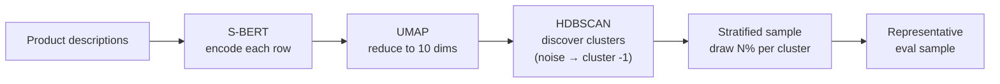

# hs-classifier

Takes a product description string and returns the best-matching Harmonized System (HS) trade codes.

## Installation

Requires Python 3.12+. Install into a virtual environment:

```bash
# 1. Create a virtual environment
uv venv && source .venv/bin/activate   # or: python -m venv .venv && source .venv/bin/activate

# 2. Install with your LLM provider
pip install "hs-classifier[anthropic] @ git+https://github.com/karandaryanani/panjiva-hscode.git"
```

Pick the extra that matches your provider:

| Extra | Provider | API key to set | Example model |
|---|---|---|---|
| `[anthropic]` | Anthropic | `ANTHROPIC_API_KEY` | `anthropic/claude-haiku-4-5-20251001` |
| `[google]` | Google Gemini | `GOOGLE_API_KEY` | `google/gemini-2.5-flash-lite` |
| `[openai]` | OpenAI | `OPENAI_API_KEY` | `openai/gpt-4o-mini` |
| `[cohere]` | Cohere | `COHERE_API_KEY` | `cohere/command-r-plus` |
| `[all]` | All of the above | — | — |

Then configure `.env` with the matching API key and model strings (see `.env.example`).

## Quick start

### 1. Install and configure

```bash
uv venv && source .venv/bin/activate
pip install "hs-classifier[google] @ git+https://github.com/karandaryanani/panjiva-hscode.git"
cp .env.example .env   # fill in API keys, Atlas DB credentials, and model choices
```

### 2. Setup

```python
from hs_classifier import init_index, init_classifier, classify_row

init_index()                     # one-time: build FAISS index from Atlas DB (skips if exists)
classifier = init_classifier()   # load heavy resources (FAISS index, S-BERT model)
```

### 3. Create an eval sample

Before classifying your full dataset, take a small representative sample using semantic clustering (S-BERT → UMAP → HDBSCAN → stratified sample). Only the text column is used for clustering — everything else passes through.

```python
import os
import polars as pl
from sentence_transformers import SentenceTransformer
from hs_classifier.splitter import prepare_eval_sample

df = pl.read_csv("data/raw/my_data.csv")
model = SentenceTransformer(os.environ["EMBEDDING_MODEL"], local_files_only=True)

sample = prepare_eval_sample(
    df, text_col="product_description", model=model, sample_frac=0.02,
)
sample.write_csv("data/raw/my_data_sample_2pct.csv")
```

### 4. Label the sample

Open the sample CSV and add a ground truth `hs_code` column — either from existing labels in your data, or by manually reviewing and annotating each row.

### 5. Classify the sample and evaluate

Run the classifier on each labeled row, collect predictions alongside ground truth, and compute metrics.

```python
from hs_classifier.evaluator import evaluation_report

labeled = pl.read_csv("data/raw/my_data_sample_2pct_labeled.csv")

results = []
for row in labeled.iter_rows(named=True):
    result = classify_row(row, classifier)
    results.append({
        "code_true": row["hs_code"],
        **{f"code_{i+1}": c for i, c in enumerate(result.codes)},
    })

results_df = pl.DataFrame(results)
report = evaluation_report(results_df, truth_col="code_true")
print(report)  # top-1, top-k, chapter accuracy + confusion matrix
```

### 6. Tune and compare

Not happy with the results? Override model and retrieval parameters per call to compare configurations — no need to edit `.env`.

```python
configs = [
    {"reranker_model": "anthropic/claude-haiku-4-5-20251001", "top_k_total": 25},
    {"reranker_model": "google/gemini-2.5-flash-lite", "top_k_total": 50},
]
for config in configs:
    results = []
    for row in labeled.iter_rows(named=True):
        r = classify_row(row, classifier, **config)
        results.append({
            "code_true": row["hs_code"],
            **{f"code_{i+1}": c for i, c in enumerate(r.codes)},
        })
    report = evaluation_report(pl.DataFrame(results), truth_col="code_true")
    # ... compare reports
```

### 7. Classify your full dataset

Once you've picked the best configuration, run it on your full dataset.

```python
df = pl.read_csv("data/raw/my_data.csv")

all_results = []
for row in df.iter_rows(named=True):
    result = classify_row(row, classifier, **best_config)
    all_results.append({
        **row,
        **{f"hs_{i+1}": c for i, c in enumerate(result.codes)},
        "reason": result.reason,
    })

classified = pl.DataFrame(all_results)
classified.write_csv("data/raw/my_data_classified.csv")
```

See [`example.ipynb`](example.ipynb) for a runnable version of this full workflow.

### CLI

```bash
uv run run_pipeline.py                          # classify a single row
uv run run_pipeline.py --row_index 5            # different row
uv run run_pipeline.py --csv_path data/raw/other.csv --row_index 0

uv run run_splitter.py --csv_path data/raw/my_data.csv --sample_frac 0.05  # create eval sample
```

## Configuration

All configuration lives in `.env` (see `.env.example` for annotated defaults). Model and retrieval parameters can also be overridden per call via `classify_row()` arguments.

### Database

| Variable | Description |
|---|---|
| `ATLAS_HOST` | PostgreSQL host for HS code data |
| `ATLAS_PORT` | PostgreSQL port (default: 5432) |
| `ATLAS_USER` | Database username |
| `ATLAS_PASSWORD` | Database password |
| `ATLAS_DB` | Database name |

### LLM providers

Install the extra for your provider (see [Installation](#installation)) and set the corresponding API key in `.env`. Models use `instructor.from_provider()` — see [Instructor docs](https://python.useinstructor.com/) for the full list of supported providers.

### Models

| Variable | Role | Overridable | Default |
|---|---|---|---|
| `EMBEDDING_MODEL` | S-BERT model for encoding HS descriptions and queries | No (rebuild index) | `dell-research-harvard/lt-un-data-fine-fine-en` |
| `SEARCH_TERM_MODEL` | LLM that generates search terms from product descriptions | `search_term_model=` | `google/gemini-2.5-flash-lite` |
| `RERANKER_MODEL` | LLM that picks the top N HS codes from candidates | `reranker_model=` | `google/gemini-2.5-flash-lite` |

### Retrieval parameters

| Variable | Overridable | Default | Description |
|---|---|---|---|
| `TOP_K_TOTAL` | `top_k_total=` | 25 | Total FAISS candidates retrieved across all searches. Higher = more candidates for the reranker (better recall, costlier reranking). |
| `TOP_K_BERT` | `top_k_bert=` | 10 | How many of those go to the original query. The rest are split evenly across the LLM-generated search terms. Higher = more weight on the raw query vs generated terms. |
| `LLM_TEMPERATURE` | `temperature=` | 0.1 | Temperature for search term generation and reranking (0.0 = deterministic, 1.0 = creative). |

### Other

| Variable | Description |
|---|---|
| `HF_TOKEN` | Hugging Face token for downloading the S-BERT model |

## How it works


**Stage 0 — Language detection** (`hs_classifier/translator.py`)
Input text is detected for language using Lingua. Non-English text is translated via the `translators` package (Google backend). If already English, translation is skipped automatically.

**Stage 1 — Search term generation** (`hs_classifier/search_terms.py`)
The LLM receives the product string, shipping context (if available), and the 97 HS2 chapter descriptions as guidance. It generates 5-8 search terms using HS vocabulary that will match well in the embedding space.

**Stage 2 — Retrieval** (`hs_classifier/retrieval.py`)
The original query and each generated term are independently embedded with S-BERT and searched against a FAISS index of HS code descriptions. Results are pooled and deduplicated, yielding ~25 candidate codes.

**Stage 3 — Reranking** (`hs_classifier/reranker.py`)
The LLM receives the candidate shortlist and selects the top N HS codes (configurable via `top_n`, default 2) with a short justification. Context is included in the prompt when available.

### How the splitter works

The eval splitter (`hs_classifier/splitter.py`) produces a representative sample for labeling and evaluation. The approach follows Dell (2025), who argues that embedding-based stratified sampling avoids two common pitfalls: keyword-based sampling, which fails to place positive probability on all instances and creates prediction bias; and active learning, which undersamples rare classes or produces unrepresentative samples under severe class imbalance.



The result is a sample that covers the full diversity of your data, including rare product types that keyword filters or random sampling would miss.

> Dell, Melissa. 2025. "Deep Learning for Economists." *Journal of Economic Literature* 63 (1): 5–58.

## Project structure

```
example.ipynb             # Full walkthrough: classify, split, evaluate
run_init.py               # One-time setup: build lookup index from Atlas DB
run_pipeline.py           # CLI wrapper for classification
run_splitter.py           # CLI wrapper for eval sample generation

hs_classifier/
├── __init__.py           # init_index(), init_classifier(), classify_row()
├── init_lookup_index.py  # DB connection, S-BERT encoding, save index parquet
├── build_query.py        # Build one classifier query from one raw row
├── translator.py         # Lingua language detection + Google translation backend
├── search_terms.py       # LLM search term generation (Instructor + Pydantic)
├── retrieval.py          # Load index parquet, FAISS search, aggregate and deduplicate
├── reranker.py           # LLM reranking of candidates (Instructor + Pydantic)
├── splitter.py           # S-BERT + UMAP + HDBSCAN clustering, stratified sampling
└── evaluator.py          # Classification metrics (top-1, top-k, chapter, confusion matrix)

data/
├── raw/                  # Sample CSV data (e.g. ecuador_sample.csv)
└── intermediate/         # hs12_4_index.parquet + hs2_chapters.parquet
```

## Future improvements

1. **HS4 → HS6 expansion:** The classifier currently returns 4-digit HS codes. A module to map these to 6-digit subheadings using the HS hierarchy and Atlas import/export weights to inform which subheading is most likely for a given product and trade context.
2. **LLM abstraction layer:** LLM calls are currently inline in `search_terms.py` and `reranker.py`. Centralizing into a single `llm.py` module would make it easy to add new providers or swap backends without touching pipeline code.
3. **Code tests:** Unit and integration tests for the classifier pipeline, evaluator, and splitter.

**Nice to have:**
- **Batch classification:** `classify_row()` processes one row at a time. A `classify_batch()` that batches LLM calls would be faster for bulk runs.
- **DeepL for translation:** The current translator uses the `translators` package with the Google backend. DeepL (free plan available) may produce better results on trade/product descriptions.
- **Vector DB:** FAISS works well at the current scale (~1,200 HS4 codes). A managed vector DB like Qdrant or LanceDB would only be worth it for persistence, filtering, or incremental updates at much larger scale.
