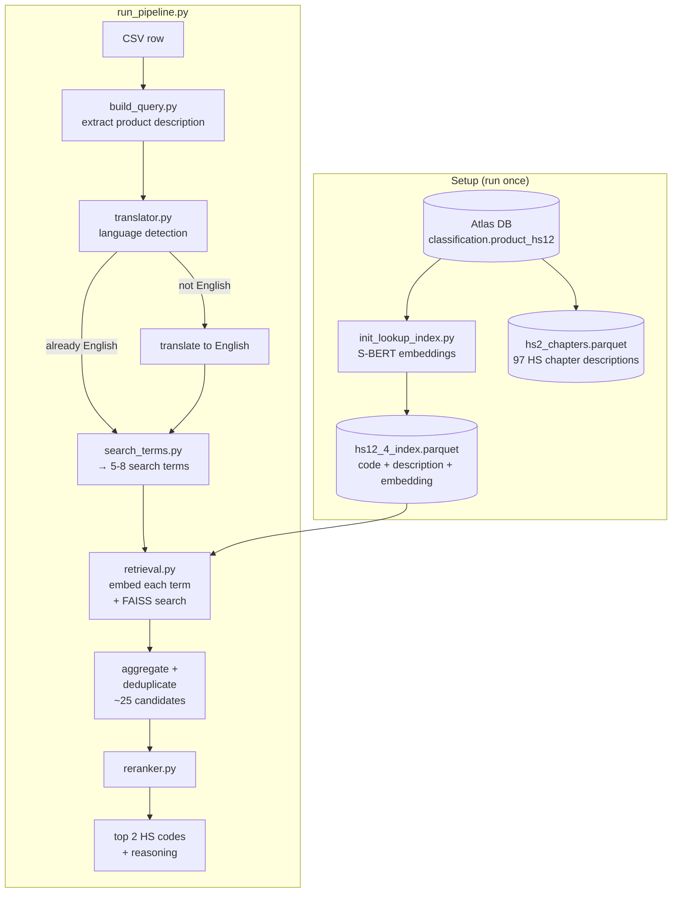

# HS Code Classifier

Takes a product description string and returns the best-matching Harmonized System (HS) trade codes.

## How it works



**Stage 0 — Language detection** (`linkages/translator.py`)
Input text is detected for language using Lingua. Non-English text is translated via the `translators` package (Google backend).

**Stage 1 — Search term generation** (`linkages/search_terms.py`)
The LLM receives the product string, shipping context, and the 97 HS2 chapter descriptions as guidance. It generates 5-8 search terms using HS vocabulary that will match well in the embedding space. Uses Instructor with a Pydantic model for structured output. Provider-agnostic via `instructor.from_provider()`.

**Stage 2 — Retrieval** (`linkages/retrieval.py`)
The original query and each generated term are independently embedded and searched against a FAISS index of HS code descriptions. Results are pooled and deduplicated, yielding ~25 candidate codes.

**Stage 3 — Reranking** (`linkages/reranker.py`)
The LLM receives the shortlist and selects the top 2 HS codes with a short justification.

## Project structure

```
run_init.py               # One-time setup: build lookup index from Atlas DB
run_pipeline.py           # Classify a single CSV row (Fire CLI)

linkages/
├── init_lookup_index.py  # DB connection, S-BERT encoding, save index parquet
├── build_query.py        # Build one classifier query from one raw row
├── config.py             # Settings: provider, API key, paths, parameters
├── translator.py         # Lingua language detection + Google translation backend
├── search_terms.py       # Pydantic model + Instructor for search term generation
├── retrieval.py          # Load index parquet, FAISS search, aggregate and deduplicate
└── reranker.py           # Prompt + tool schema for reranking

data/
├── raw/                  # Sample CSV data (e.g. ecuador_sample.csv)
└── intermediate/         # hs12_4_index.parquet + hs2_chapters.parquet
```

## Branches

- `main` keeps the MVP classifier only: load HS data, retrieve candidates, rerank, and return top HS codes.
- `evals` is for split construction, labeling, metrics, notebooks, and benchmark workflow.
- `llm-upgrade` is for provider abstraction work, including making `search_terms.py` and `reranker.py` call through a shared LLM interface.

## Setup

```bash
uv sync
cp .env.example .env  # fill in GOOGLE_API_KEY, HF_TOKEN, and Atlas DB credentials
```

### Initialize the lookup index

Pulls HS code descriptions from the Atlas DB, generates S-BERT embeddings, and saves two parquets (HS4 index with embeddings + HS2 chapters for prompt context):

```bash
uv run run_init.py            # skips if parquet already exists
uv run run_init.py --force    # rebuild
```

### Classify a row

```bash
uv run run_pipeline.py                          # default: row 1 from ecuador_sample
uv run run_pipeline.py --row_index 5            # different row
uv run run_pipeline.py --csv_path data/raw/other.csv --row_index 0
```

## Models

| Role | Model |
|---|---|
| Embeddings | `dell-research-harvard/lt-un-data-fine-fine-en` (S-BERT, trade concordance fine-tune) |
| Term generation | Gemini 2.5 Flash Lite (configurable via `--model`) |
| Reranking | Gemini 2.5 Flash Lite (configurable) |

## Future improvements

- **DeepL for translation (optional):** The current translator uses the `translators` package with the Google backend. A potential upgrade is to use the DeepL API directly (free plan available) for better translation quality, especially on trade/product descriptions.
- **Vector DB (optional):** FAISS works well at the current scale (~1,200 HS4 codes). A managed vector DB like Qdrant or LanceDB would only be worth it if we need persistence, filtering, or incremental updates at much larger scale.

## Notes

This is a rewrite of an earlier monolithic script. Key differences:

- **FAISS built once** — the original rebuilt the index on every query (~48,000 times per full run)
- **No hardcoded secrets** — API keys now loaded from `.env`
- **HS data from Atlas DB** — no longer depends on a local Excel file
- **Flat structure** — original was a single 440-line script; now split into focused modules
