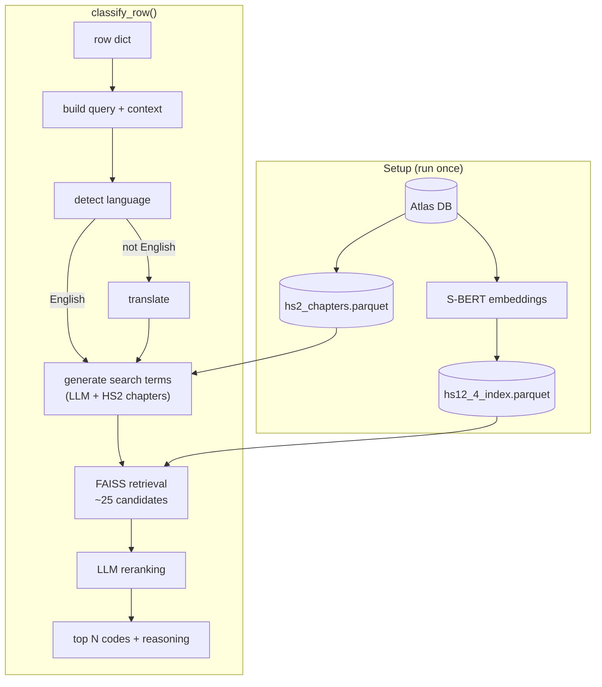

# hs-classifier

Takes a product description string and returns the best-matching Harmonized System (HS) trade codes.

```python
from hs_classifier import init_index, init_classifier, classify_row

init_index()                     # one-time: build FAISS index from Atlas DB
classifier = init_classifier()   # load FAISS index + S-BERT model

result = classify_row({"product_description": "organic bananas"}, classifier)
print(result)

# retrieval-only ablation: skip the final reranking step
fast_result = classify_row(
    {"product_description": "organic bananas"},
    classifier,
    skip_reranking=True,
)
```

```json
{
  "codes": ["0803", "0806"],
  "descriptions": ["Bananas, including plantains, fresh or dried", "Grapes, fresh or dried"],
  "reason": "The product is explicitly bananas, matching HS 0803...",
  "search_terms": ["fresh fruit tropical", "banana plantain", ...],
  "detected_language": "en"
}
```

## Installation

Requires Python 3.12+.

```bash
uv venv && source .venv/bin/activate
pip install "hs-classifier @ git+https://github.com/karandaryanani/panjiva-hscode.git"
cp .env.example .env   # fill in OpenAI, Atlas DB, and embedding settings
```

The package now uses OpenAI for all LLM steps. Set `OPENAI_API_KEY` in your `.env`. The supported default model is `gpt-5-nano`.

To run the [`example.ipynb`](example.ipynb) notebook, add the `notebook` extra:

```bash
pip install "hs-classifier[notebook] @ git+https://github.com/karandaryanani/panjiva-hscode.git"
```

## Quick start

The [`example.ipynb`](example.ipynb) notebook walks through the full workflow: index setup, classification, eval sampling, labeling, evaluation, and tuning. Start there.

## How it works

### Classification



**Language detection** — Input text is checked with Lingua. Non-English text is translated via the `translators` package (Google backend).

**Search term generation** — The LLM receives the product string, shipping context, and the 97 HS2 chapter descriptions. It generates 5-8 search terms using HS vocabulary to match well in the embedding space.

**Retrieval** — The original query and each generated term are embedded with S-BERT and searched against a FAISS index. Results are pooled and deduplicated.

**Reranking** — The LLM receives the candidate shortlist and selects the top N codes with a short justification. For ablations or fast retrieval-only runs, `classify_row(..., skip_reranking=True)` returns the top retrieval hits directly instead.

### Eval sampling

The eval splitter produces a representative sample for labeling and evaluation. The approach follows [Dell (2025)](https://doi.org/10.1257/jel.20231668), who argues that embedding-based stratified sampling avoids two common pitfalls: keyword-based sampling, which fails to place positive probability on all instances; and active learning, which undersamples rare classes under severe class imbalance.


The result is a sample that covers the full diversity of your data, including rare product types that keyword filters or random sampling would miss.

## Developer

### Project structure

```
example.ipynb             # Full walkthrough: classify, split, evaluate
run_init.py               # One-time setup: build lookup index from Atlas DB
run_pipeline.py           # CLI: classify a single row (--row_index, --csv_path)
run_splitter.py           # CLI: generate eval sample (--csv_path, --sample_frac)

hs_classifier/
├── __init__.py           # init_index(), init_classifier(), classify_row()
├── init_lookup_index.py  # DB connection, S-BERT encoding, save index parquet
├── build_query.py        # Build one classifier query from one raw row
├── translator.py         # Lingua language detection + Google translation backend
├── search_terms.py       # LLM search term generation (Instructor + Pydantic)
├── retrieval.py          # Load index parquet, FAISS search, aggregate and deduplicate
├── reranker.py           # LLM reranking of candidates (Instructor + Pydantic)
├── splitter.py           # S-BERT + UMAP + HDBSCAN clustering, stratified sampling
└── evaluator.py          # Classification metrics with readable counts + summary

data/
├── raw/                  # Sample CSV data
└── intermediate/         # Parquet artifacts + splitter outputs under samples/
```

### Configuration

All configuration lives in `.env` (see [`.env.example`](.env.example) for annotated defaults). Retrieval parameters can also be overridden per call via `classify_row()` keyword arguments.

| Variable | Role | Per-call override | Default |
|---|---|---|---|
| `EMBEDDING_MODEL` | S-BERT model for encoding descriptions and queries | — (rebuild index) | `dell-research-harvard/lt-un-data-fine-fine-en` |
| `OPENAI_MODEL` | OpenAI model used for search terms and reranking | — | `gpt-5-nano` |
| `TOP_K_TOTAL` | Total FAISS candidates retrieved | `top_k_total=` | 25 |
| `TOP_K_BERT` | Candidates allocated to the raw query | `top_k_bert=` | 10 |
| `LLM_TEMPERATURE` | Temperature for LLM calls | `temperature=` | 0.1 |
| `INTERMEDIATE_DATA_DIR` | Directory for parquet artifacts | `intermediate_data_dir=` | `data/intermediate` |

`classify_row()` also accepts `skip_reranking=True` to bypass the final reranker and return the top retrieval candidates directly while keeping the same result schema.

Database and credential variables (`ATLAS_*`, `HF_TOKEN`, `OPENAI_API_KEY`) are documented in [`.env.example`](.env.example).

### Nice to have

- **Support NAICS:** The core pipeline is taxonomy-agnostic in principle. Extending to NAICS would mainly require a new index. The [econ-embeddings](https://github.com/shreyasgm/econ-embeddings) work is relevant here — embeddings trained across economic taxonomies would enable better cross-domain retrieval and reranking.
- **Batch classification:** A `classify_batch()` that batches LLM calls for bulk runs.
- **Vector DB:** FAISS works well at ~1,200 HS4 codes. A managed vector DB would only matter at much larger scale.
